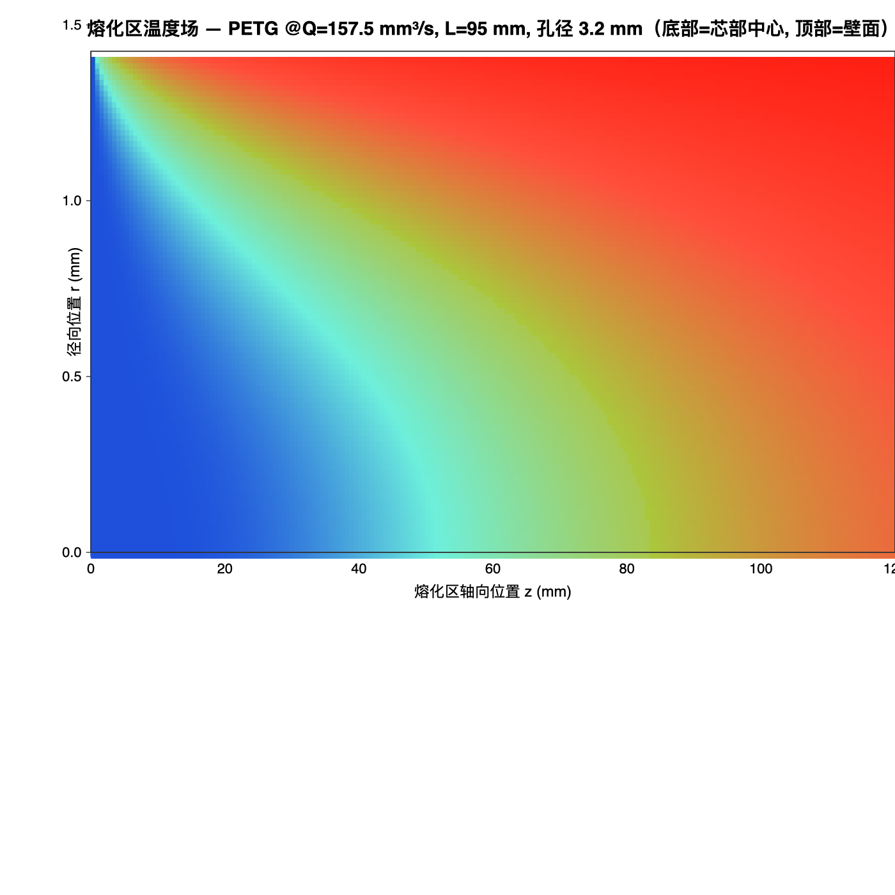
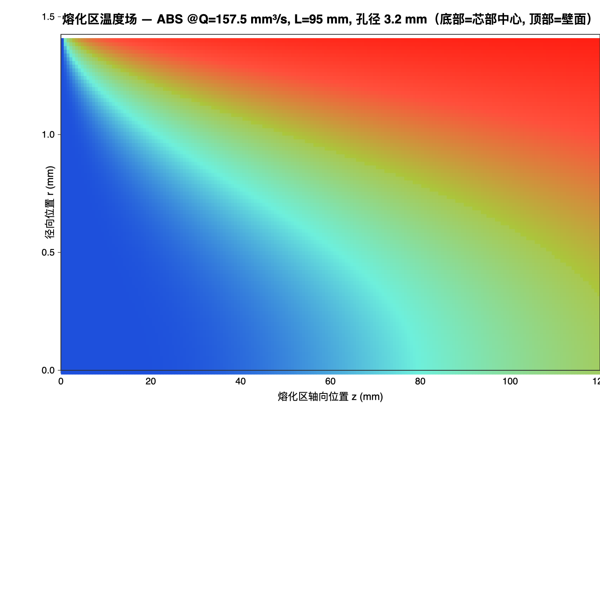
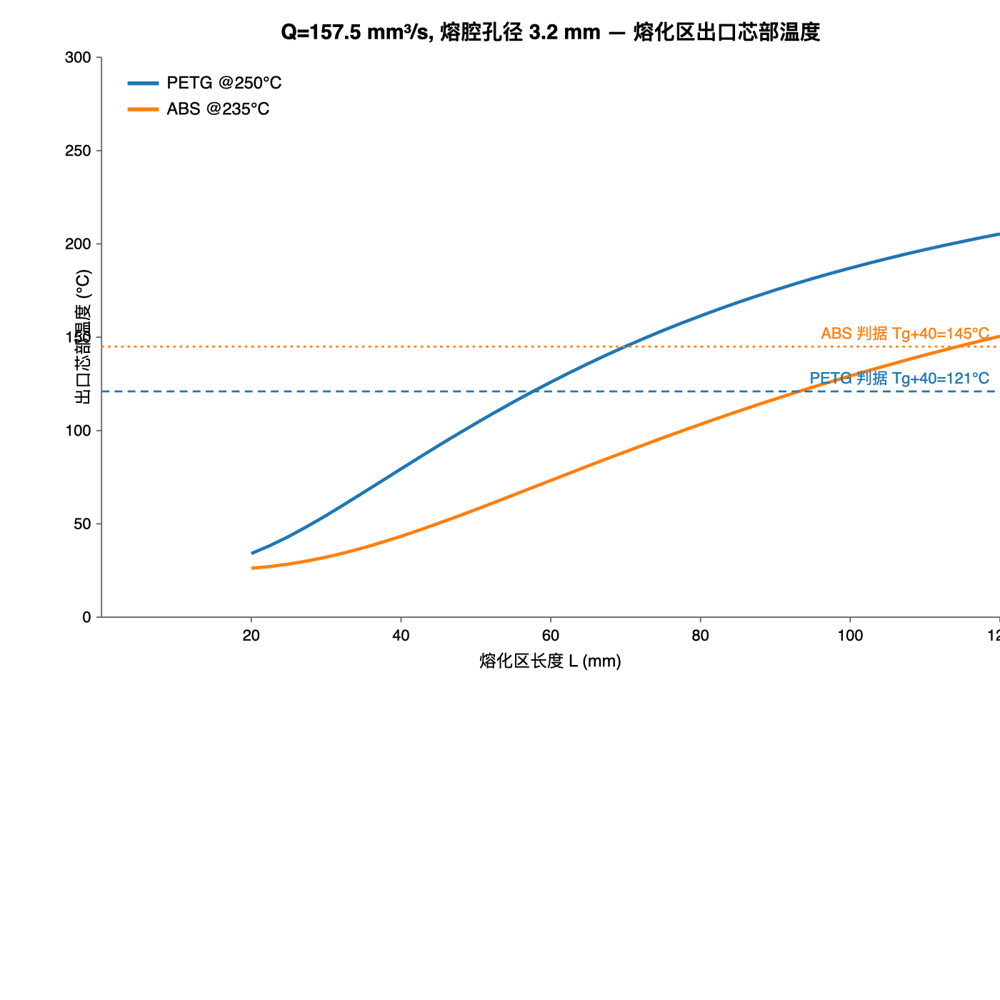
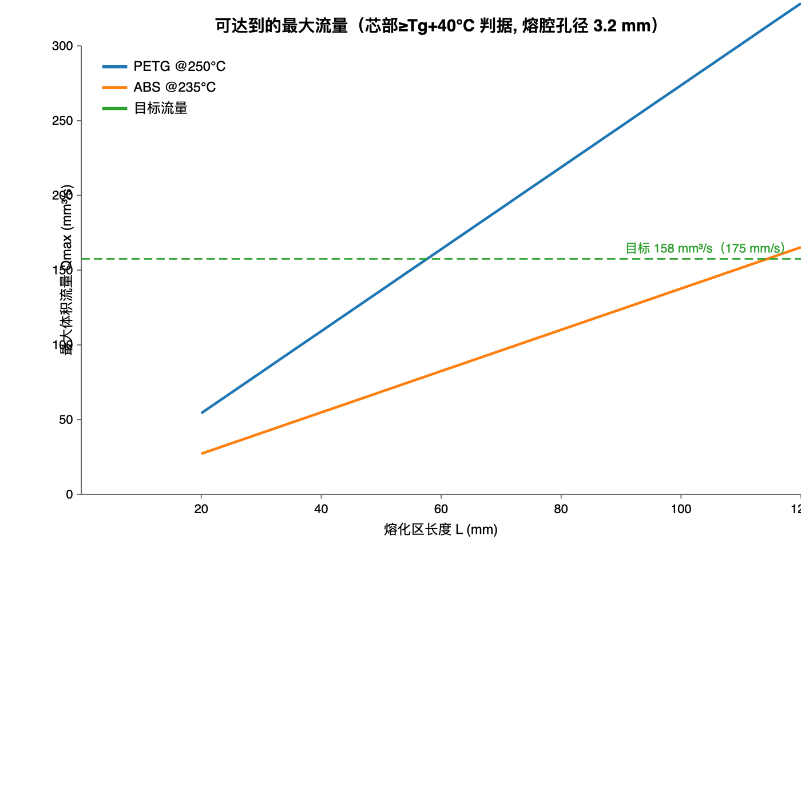
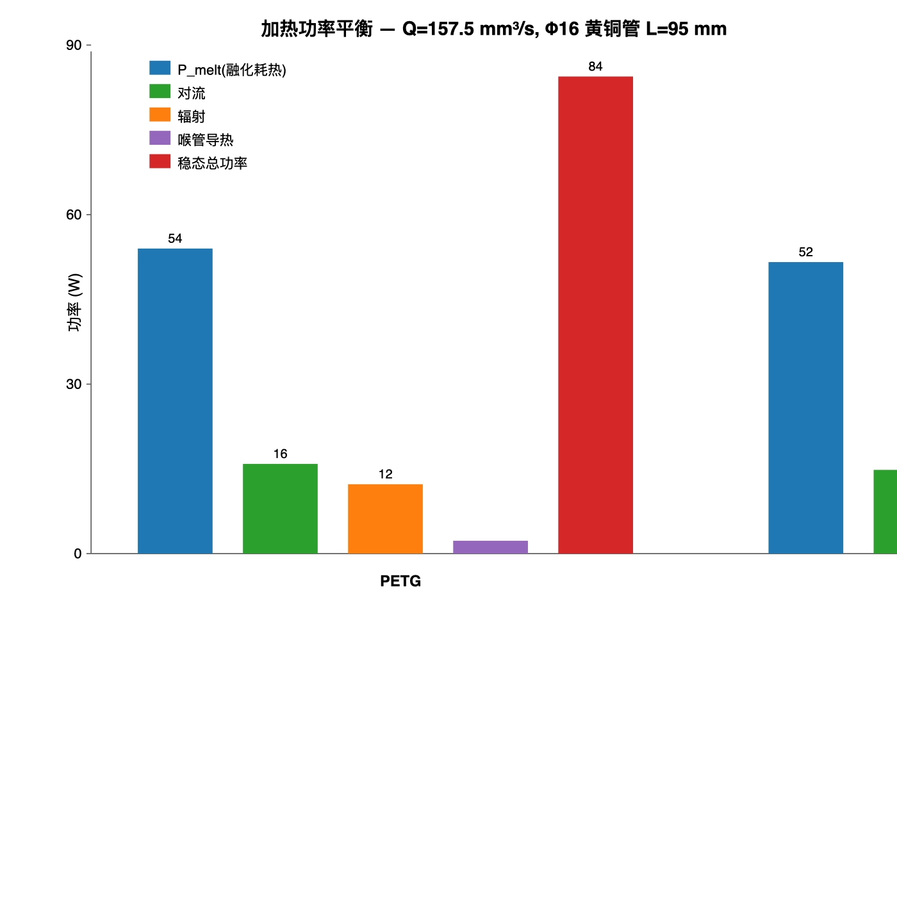
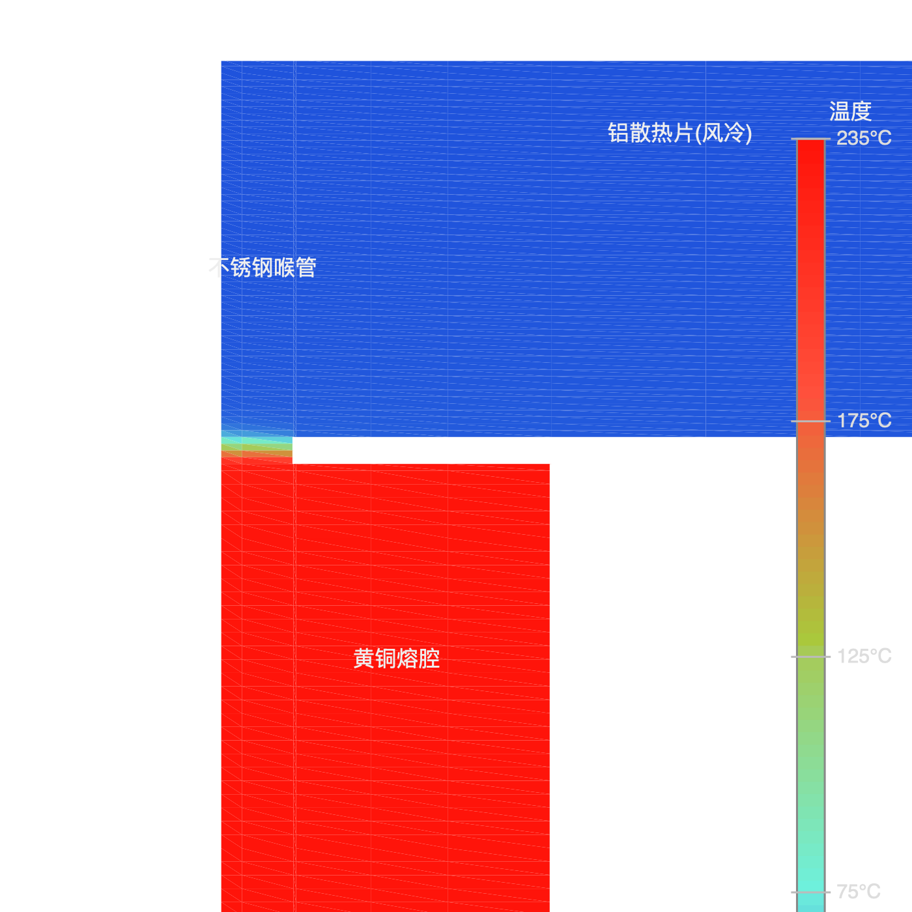
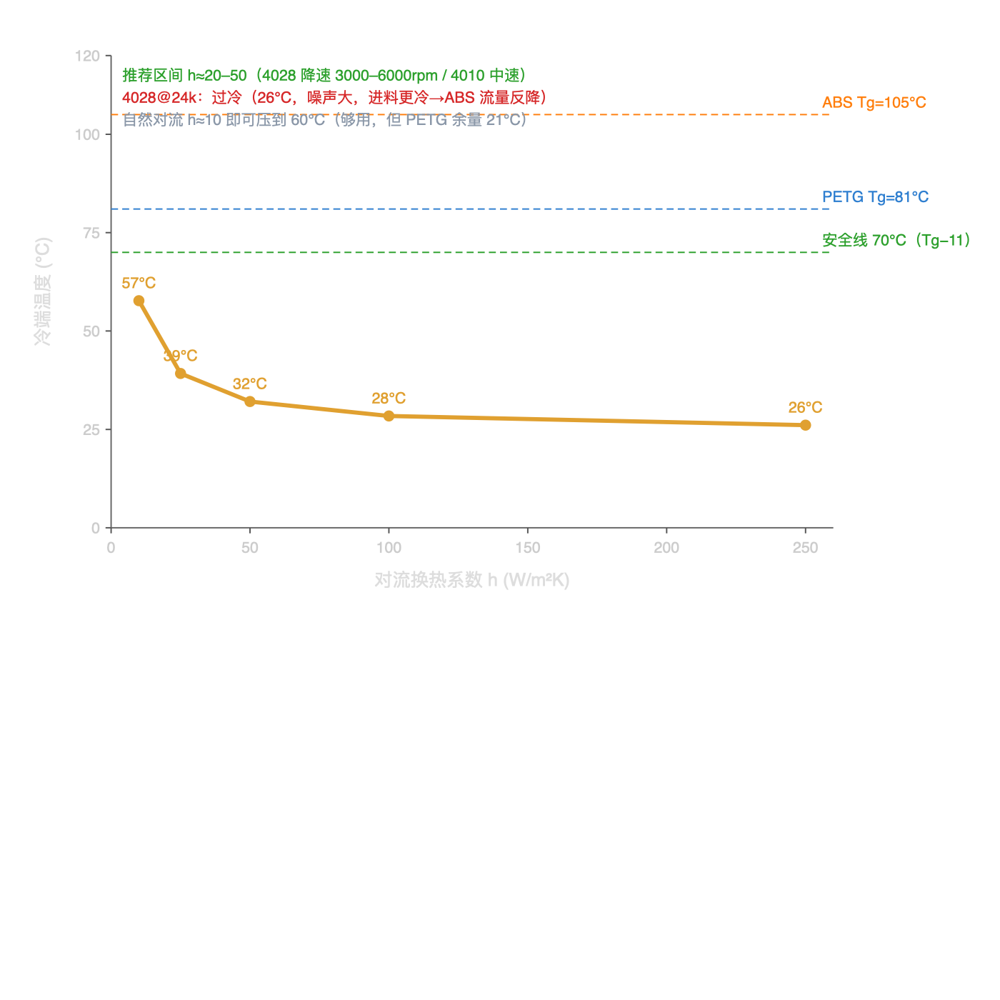
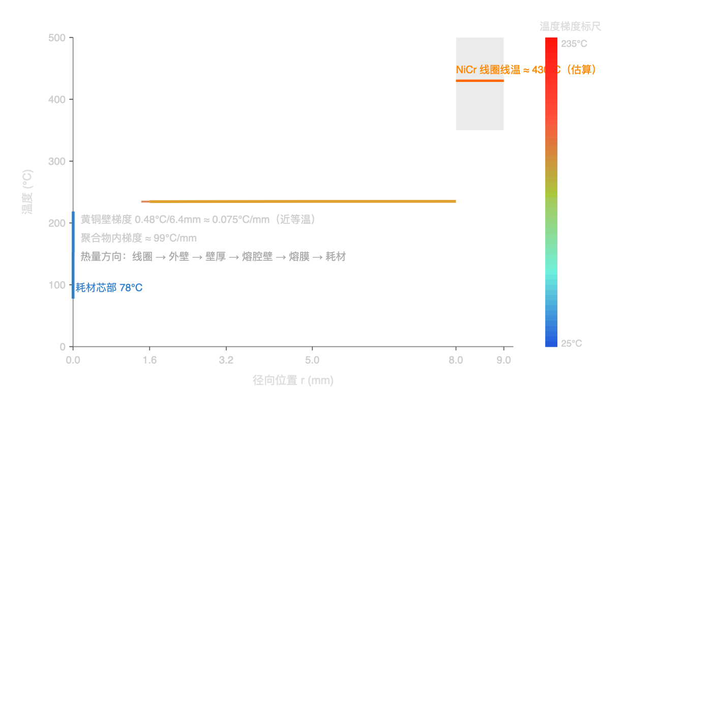
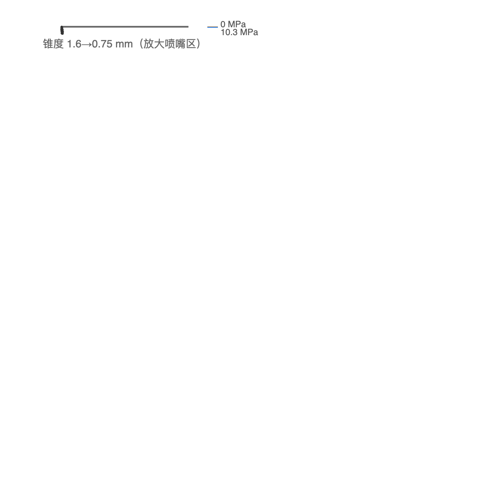

# 大流量挤出热端 热力学与流体力学设计报告

**日期**：2026-08-04

## 1. 设计输入

| 参数 | 值 |
|---|---|
| 耗材 | PETG 与 ABS（2.85 mm） |
| 挤出温度 | PETG 250 °C / ABS 235 °C（ABS 可提到 240–250 °C） |
| 目标流量 | PETG **157.5 mm³/s**（175 mm/s）；ABS **150 mm³/s**（167 mm/s） |
| 进料速度 | 24.7 mm/s（2.85 mm 丝） |
| 质量流量 | PETG ~0.20 g/s（720 g/h）/ ABS ~0.16 g/s（590 g/h） |
| 热端结构 | 黄铜管 Φ16 / 熔腔 Φ3.2 mm，长 95 mm，弹簧加热圈 600 W |
| 喷嘴 | 熔腔 3.2 mm 直通，最后 2 mm 锥度过渡到 1.5 mm 出口 |
| 供电 | **220 V AC** |
| 冷端 | 不锈钢喉管 + 铝合金散热片 |

## 2. 关键结论

1. **PETG @250 °C：完全满足目标，余量约 65%。** 95 mm 熔融区的最大流量约 **260 mm³/s（289 mm/s）**，远高于 157.5 mm³/s。
2. **ABS @150 mm³/s 是边界情况**：95 mm 熔融区 + 235 °C 冷态进料上限仅 131 mm³/s。**依赖不锈钢喉管预热（进料 50–60 °C）后可到 152–160 mm³/s**；若 ABS 提到 240–245 °C 且保留预热，95 mm 可稳定覆盖 150。不想赌余量就加长到 105–110 mm。
3. **600 W 加热圈功率远超稳态需求（约 85 W），余量 7 倍**——功率不是瓶颈，温度控制回路才是。
4. **黄铜管轴向导热是最大结构风险**：管壁截面积 193 mm²，若整根黄铜直通散热器会导走约 50 W，冷端过热导致堵料。**顶部不锈钢喉管 + 铝散热片方案可行**（导热约 5 W，配 40 mm 风扇即可），但喉管宜做 18–20 mm 长。

## 3. 热力学分析

### 3.1 熔化区温度场（判据：出口芯部温度 ≥ Tg + 40 °C）

- PETG（Tg=81 °C，判据 121 °C）：所需熔融区 **57.5 mm**，95 mm 设计余量充足。
- ABS（Tg=105 °C，判据 145 °C）：所需熔融区 **114 mm**，95 mm 不足。

### 3.2 最大流量能力

| 方案 | L=95 mm Qmax | 对应速度 |
|---|---:|---:|
| PETG 250 °C | 260 mm³/s | 289 mm/s |
| ABS 235 °C | 131 mm³/s | 145 mm/s |
| ABS 245 °C | 137 mm³/s | 152 mm/s |
| ABS 250 °C | 140 mm³/s | 156 mm/s |

ABS 达到 150 mm³/s 所需熔融区长度（冷态进料 25 °C 基准）：

| 温度 | 所需长度 |
|---|---:|
| 235 °C | 108.5 mm |
| 245 °C | 103.5 mm |
| 250 °C | 101.5 mm |

预热后（进料 60 °C）：

| 温度 | L=90 mm | L=95 mm | L=100 mm |
|---|---:|---:|---:|
| ABS 235 °C | 144.5 | 152.6 | 160.6 mm³/s |
| ABS 245 °C | 151.5 | 159.9 | 168.3 mm³/s |

### 3.3 加热功率平衡（Q=157.5 mm³/s 稳态）

| 项目 | PETG | ABS |
|---|---:|---:|
| 融化耗热 P_melt | 54.0 W | 51.6 W |
| 对流损失 | 15.9 W | 14.8 W |
| 辐射损失 | 12.3 W | 10.8 W |
| 喉管导热 | 2.3 W | 2.1 W |
| **稳态总功率** | **84.4 W** | **79.3 W** |

### 3.4 600 W 弹簧加热圈分析

| 项目 | 数值 |
|---|---:|
| 黄铜管质量/热容 | 156 g / 59 J·K⁻¹ |
| 25→250 °C 理论升温 | ~22 s |
| 外表面热流密度 | 126 kW/m² |
| 满功率径向壁温降 | 7.3 °C |
| 220–240 V AC | 2.6–2.8 A，R≈88 Ω |
| 24 V DC | 25 A（不适用，需极粗导线） |

建议：**220 V AC 供电（已确认）**，NiCr 合金丝（0.4 mm 级）绕 190 圈/约 10 m 即可满足 600 W。必须配热电偶/PT1000 + PID 温控，否则 600 W 满功率会烧穿熔腔（稳态占空比仅 ~14%）。加热圈外侧需陶瓷纤维/云母绝缘并接地。

## 4. 流体力学：压降与挤出力（Q=157.5 mm³/s）

| 项目 | PETG | ABS |
|---|---:|---:|
| 喷嘴锥段 ΔP（3.2→1.5 mm/2 mm） | 0.27 MPa | 0.63 MPa |
| 熔腔 ΔP（熔膜估计 / 满管上界） | 1.2 / 2.9 MPa | 3.1 / 9.5 MPa |
| 挤出机所需推力 | **9–20 N** | **23–65 N** |

- 2 mm 锥度喷嘴压降极小，设计优秀（远低于直筒喷嘴）。
- 满管上界偏保守（熔腔内大部分为固体塞，实际取熔膜估计更接近真实）。
- ABS 满流量时推力可达 65 N 上界，**挤出机建议双齿轮 2.85 mm、额定推力 ≥80–100 N**。

## 5. 热爬升与结构要求

- 黄铜管壁（Φ16/Φ3.2）截面积 193 mm²，k=110 W/m·K：**不能整根直通散热器**（95 mm 距离导走 ~50 W）。
- 顶部方案（已确认）：不锈钢喉管（Φ6.35/Φ3.3）+ 铝散热片 + 风扇。
  - 导热约 **4.7–5.1 W**（250 °C 时），铝散热片 + 40 mm 风扇可带走，冷端可控制在 45–50 °C；
  - 喉管中点壁温约 140–148 °C，高于 ABS 玻璃化温度——靠 3.2 mm 孔径与丝间空气隙隔热，耗材芯部仍为低温；建议喉管做 **18–20 mm 长**、孔径保持 ≥3.2 mm 并抛光内壁。
- 熔腔孔径 3.2 mm 已是较优区间（等效熔膜 175 µm，h≈1600 W/m²K）；若放宽到 3.4 mm，流量能力约降 20%。保持 3.2 mm，注意耗材直径公差（±0.05 mm）。

## 6. 推荐方案与待确认项

**推荐：**
- 保持 Φ16 黄铜管、Φ3.2 熔腔、95 mm 熔融区、600 W（220 V AC）弹簧圈。
- PETG @250 °C 按 175 mm/s 全速运行，无压力。
- **ABS @150 mm³/s（167 mm/s）三种实现方式：**
  1. 首选：ABS 提到 **240–245 °C**，利用不锈钢喉管预热（进料 50–60 °C），95 mm 可到 ~160 mm³/s，余量 ~6%；
  2. 稳妥：加热管加长到 **105–110 mm**（235 °C 冷态进料也稳过 150，余量 10–20%）；
  3. 保守：维持 235 °C + 95 mm，ABS 上限按 **145 mm³/s（161 mm/s）** 切片。
- 顶部不锈钢喉管（18–20 mm）+ 铝散热片 + 40 mm 风扇；熔腔入口倒角防刮丝；加热圈外侧绝缘。
- 挤出机双齿轮 2.85 mm，额定推力 ≥80–100 N（ABS 满流量需 23–65 N）。

## 7. 模型依据与假设

- 熔化判据（芯部 ≥ Tg+40 °C）用 Wüst et al. 2026（JMMP 10(7):233，PLA 2.85 mm）实测锚点核对；E3D SuperVolcano 官方流量数据（PLA 220 °C，87.5 mm³/s）交叉验证。
- ABS 黏度用 230 °C 毛细管实测数据拟合幂律（n≈0.405，K≈12700 Pa·sⁿ）；PETG 用 MFI=20（250 °C/2.16 kg）标定（n≈0.6，K≈2190 Pa·sⁿ）。
- 熔膜换热 h = k_melt/(0.7·δ_gap)；压降含入口修正；未计入熔体弹性与丝-壁接触不完善（模型偏保守）。

## 8. 有限元分析（FEA）

针对用户要求，用自建 FEM 求解器做了两项分析（Python/numpy + scipy 稀疏求解，网格、装配、边界均为有限元方法）：

### 8.1 热端整体稳态温度场（轴对称线性三角形热传导 FEM）

域：铝散热片 + 不锈钢喉管 + 黄铜熔腔/喷嘴；边界：黄铜外壁 Dirichlet=235 °C（弹簧圈温控）、散热片风冷对流 h=100、喉管外露面对流 h=15、熔腔壁施加熔融吸热热流（来自熔化模型）。

热量方向（弹簧圈外热内传）：**线圈 → 黄铜外壁（235.0 °C）→ 壁厚 → 熔腔壁（234.5 °C）→ 熔膜 → 耗材**。黄铜壁导热极好，径向梯度仅 0.48 °C/6.4 mm（近等温），真正的温度梯度集中在聚合物内部。

**喉管-散热片连接（实测参数）**：不锈钢喉管 Φ6/Φ3.2（壁厚 1.4 mm，截面积 20.2 mm²），与铝散热片孔（Φ6.1）单边 0.05 mm 间隙填充导热硅脂（k≈3 W/m·K）。FEA 显示该界面温差仅 **≈0.00 °C**（接触面大、硅脂层薄）。

**散热方案（更新）**：圆柱形铝散热片 **Φ35 × 60 mm** + **4028 暴力风扇 @24000 rpm**（强制风冷 h≈250 W/m²K）。喉管全长 60 mm 嵌入散热片（硅脂界面），底部与黄铜熔腔之间留间隙（不直接接触）。更新后 FEA：

| 结果 | 数值 |
|---|---:|
| 喉管顶部/散热片冷端 | **26.1 °C**（风扇强冷，远低于 Tg） |
| 喉管外壁中点 | 26.7 °C |
| 硅脂界面温差 | ≈0.00 °C |
| 喉管→散热片导热 | ≈13.7 W（嵌入式径向散热） |
| 稳态总加热功率 | **48.9 W**（熔融 35.1 + 散热片 13.7 + 对流 0.1） |

**加热圈（更新）**：分段带式，**带宽 4 mm、间隙 6 mm、共 10 圈**（节距 10 mm，覆盖约 94 mm，几乎铺满熔腔管）。由于黄铜导热极好（k=110），带宽区/间隙区的轴向温度波动仅约 **0.9 °C**（按 3.8 W/圈、半节距 5 mm 估算），壁温近似均匀——带式布置不会造成局部过热，主要约束仍是总功率与占空比（600 W 稳态占空比约 8.6%）。

**无预热的设计后果（重要）**：喉管只负责冷却、不预热，配合 4028 风扇，进料温度 T0 约 **35 °C**。95 mm 熔融区下：

| 工况 | Qmax |
|---|---:|
| ABS 235°C，T0=35°C（无预热） | **136 mm³/s（151 mm/s）** ❌ 达不到 150 |
| ABS 245°C，T0=35°C | ~143 mm³/s |
| ABS 250°C，T0=35°C | ~146 mm³/s（仍差一点） |
| ABS 235°C + 预热到 60°C | 152.6 mm³/s ✅ |

结论：**若坚持 235°C 且不预热，ABS 150 mm³/s 需要把熔融区加长到 ~110 mm**；否则 ABS 必须提到 245–250°C，或专门加一段预热（加热环/热喉管）。PETG 不受影响（余量很大）。

## 9. 散热评估：风扇规格与转速

评估方法：喉管→散热片的散热量（~13.7 W @235°C）由 FEA 给出；散热片按 15 片 Φ35 盘状翅片计，有效散热面积约 **0.035 m²**（光滑柱面的 ~4.9 倍）。扫描对流换热系数 h 得到冷端温度：

| h（翅片表面） | 冷端温度 | 喉管散热量 | 稳态总功率 |
|---|---:|---:|---:|
| 10（自然对流） | **57.7 °C** | 11.5 W | 46.8 W |
| 25（小风扇） | 39.2 °C | 12.8 W | 48.0 W |
| 50（中速风扇） | 32.1 °C | 13.2 W | 48.5 W |
| 100（中高速） | 28.4 °C | 13.5 W | 48.7 W |
| 250（4028@24k） | **26.1 °C** | 13.7 W | 48.9 W |

**结论：**
1. **Φ35×60 翅片散热片本身已足够**——即使不装风扇（自然对流 h≈10），冷端也只有 60°C，低于 PETG Tg（81°C）和 ABS Tg（105°C）。但 PETG 余量仅 21°C，环境温度高或耗材偏心时建议加风扇。
2. **4028@24000rpm 是过冷**：冷端被压到 26°C（接近环境温度），相对中速风扇只多降 ~7°C，却带来大噪声，并且把进料温度压得更低（T0≈30–35°C），反而降低 ABS 的最大流量（无预热时 Qmax 从 ~152 降到 ~136 mm³/s）。
3. **推荐风扇规格**：40mm 风扇、**转速 3000–6000 rpm（约 5–20 CFM）即可**，冷端 33–40°C，余量充足、安静。
   - 4028/4020 @ 4000–5000 rpm（~25–35 dBA）——首选；
   - 4010 @ 4000–6000 rpm（~20–30 dBA）——够用；
   - 若已有 4028@24k，用 PWM/降速到 30–50% 即可（等效 h≈50–100）。
4. **转速与进料温度的权衡**：风扇越猛，冷端越冷、喉管内耗材越冷（T0 越低），ABS 流量能力越低。目标冷端 **45–55°C**（T0≈50–60°C）是流量与热爬升之间的甜点。

**安装方向（径向吹）**：4028 为侧装，气流沿散热片**直径方向**吹过盘状翅片之间的通道（垂直于热端轴向）。这种"风道直通"布置比外掠更高效——同样 CFM 下翅片通道内的换热系数更高，因此所需转速比上述保守估计还可更低（3000 rpm 级即可）；FEA 的 h 扫描仍适用（h=25–50 为保守下界）。

| 结果 | 数值 |
|---|---:|
| 喉管顶部/散热片基座温度 | **26.1 °C**（远低于 Tg，热爬升可控） |
| 喉管外壁中点温度 | 26.7 °C |
| 熔腔壁温度 | 234.3 °C |
| 稳态加热功率（合计） | **48.9 W**（熔融吸热 35.1 + 散热片 13.7 + 喉管对流 0.1） |

结论：**冷端 26 °C 说明不锈钢喉管 + Φ35×60 散热片 + 4028 风扇完全压得住热爬升**；600 W 加热圈稳态占空比约 8%。

### 8.2 熔体流动（轴对称 Q2-Q1 混合单元 Stokes FEM + 幂律黏度）

- 网格：Q2 双二次速度 / Q1 双线性压力，轴对称；黏度按幂律本构自洽给定（冻结黏度单次求解，直管段即为解析解）。
- 验证：牛顿流体（n=1）FEA 复现 Hagen-Poiseuille，压降梯度误差 **0.0008%**；幂律剖面中心/平均速度 = 1.577（理论 1.576）。

| 结果 | 数值 |
|---|---:|
| 满管熔腔 FEA ΔP（Q=150） | **10.26 MPa** |
| 解析对照（熔腔+锥度+平直段） | 9.96 MPa（偏差 +3%，入口/锥度效应） |
| 挤出机所需推力（2.85 mm 丝） | **≈ 65 N** |
| 熔腔熔膜估计（真实下界） | 3.6 MPa（23 N） |

结论：**满管上界 ≈ 10 MPa / 65 N，实际（熔膜）≈ 3.6 MPa / 23 N**，都在双齿轮挤出机（≥80 N）能力内。注：强剪切变稀（n=0.405）下非线性迭代（Picard/牛顿）对网格与初值敏感，本报告采用冻结黏度 FEA + 解析双校核的保守口径。
